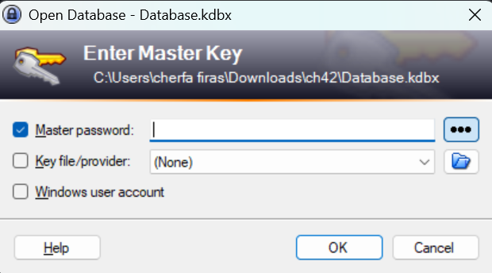
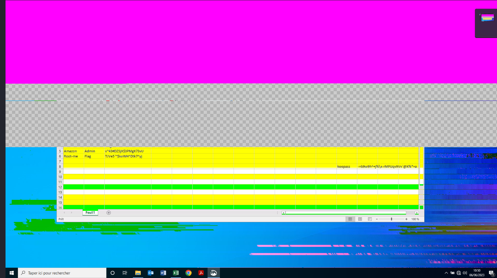
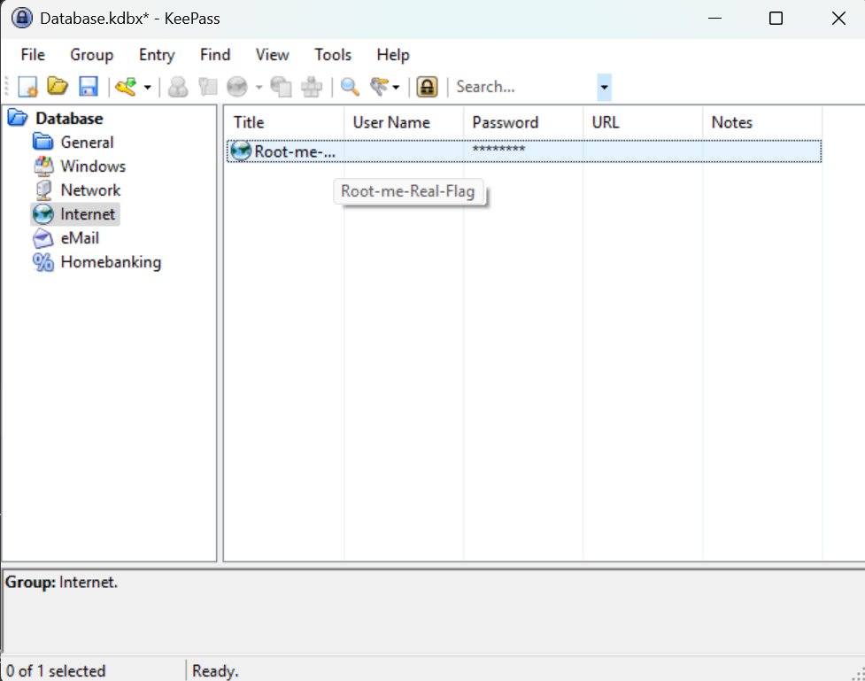

# Capture this - Root-Me Challenge 
**Platform:** Root-Me | **Solved by:** Cherfa Firas 

> **Challenge:**
>An employee has lost his Keepass password. He couldn’t remember it, and couldn’t find his password file. After hours of searching, it turns out that he has sent a screen of his passwords to one of his colleagues, but it’s still nowhere to be found.
He’s asking for your help to find him.
It’s up to you


---
## First step : Extract files and examine them 
First , we get a `.zip` file. Extract it using :

```bash
unzip file.zip 
``` 

Inside , we will find two new files a png image , and ```kdbx``` extension file 

before we keep on with this write up 

### what is a kdbx file ?
It's basically nothing but an encrypted data-base file used by ```KeePass``` , which is an  open-source passwords manager .

A ```.kdbx``` file stores : 
- Usernames and passwords ( Probablly our flag is there )
- Optional informations like creation dates , modifications etc 

It is also protected by ``` Encryption Techniques ``` like ``` AES-256 , ChaCha20 ```

In order to unlock this file , we need a ``` Master password ``` and that is what we are going to be looking for in this challenge in order to find the flag 

## Second step : Oppening the image and finding clues 
Looking at the png file the challenge provided for us , we can see some passwords which obviously not the solution for our challenge.
<p align="center">  </p>  

Later we try to open the ``` .kdbx ``` file with ``` KeePass ``` Windows tool and we see that it asks for a ``` Masters Password ``` to get access 
<p align="center">  </p>  

 
After a long turn and looping arround I decided to go back to the Image and analyse it carefullt looking for clues , and my eye catched a letter ``` k ``` peaking at me , so the image was actually cropped ? and it can be the masters password or maybe the flag it self .

Before that let us talk about , how images actuallty get ``` cropped ```  :

An image is basically a 2D array of pixels , a Matrix of pixels , cropping it means taking a sub region of those pixels and discard the rest in other words : 

- A computer loads the image decode it from its format (PNG , JPEG) into memory as raw pixel buffer .
- Select a cropping box 
- Then just extract the cropped area and re-encode it into an image format .

## Third Step : Get the cropped part back , and find the Flag !

As i was checking if there was any way to restore a cropped part of an image i came across ``` ACROPALYPSE Vulnerability ``` , so what is it about : 
its a vulnerability that allows attackers to recover uncropped versions of screenshots edited using Markup tool on google pixel as well as ``` Microsoft Snipping tool ``` on windows 11 , how is that even possible ? 
### How aCROPALYPSE vulnerability works :
In the tools I mentionned earlier :
- When you cropp the image the software did not discard the uncropped image data instead 
- It only changes the header of the image data and leave the rest of the original image there 

## For example : 
- A PNG file is made of 
- IHDR : header 
- IDAT : Image data 
- IEND : The end 

the cropped file will look like this : 
new IHDR + new IDAT + new IEND + (leftovers of the old IDAT)

And like that attackers can restore the cropped images 

- Now we get into restoring data 

I used a ``` python ``` script that will do the job for me (you will find it in another file)

This script will save the new image as ``` restored.png ``` in your system temporary directory :
- linux :  /tmp/restored.png
- Windows : C:\Users\<YourUsername>\AppData\Local\Temp\restored.png

<p align="center">  </p>  

AHHH ! here we can notice that we found a keypass ``` -=b9w9h^+j%\x-rMPUqv9Vv`@X%*=a ``` , make sure to write it correctly .

<p align="center">  </p>  

Congratulations you got the flag ``` @cropalypse_vuln_is_impressive ```


