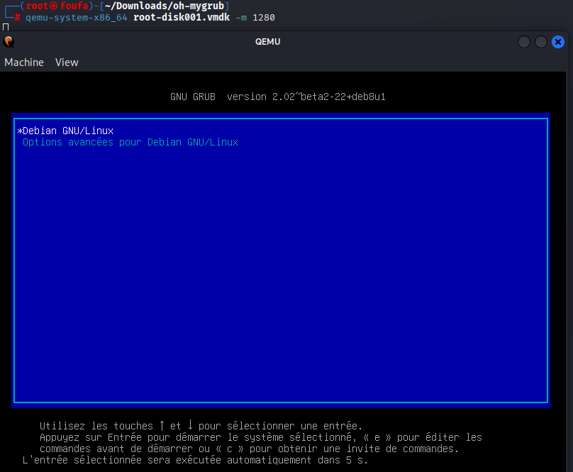
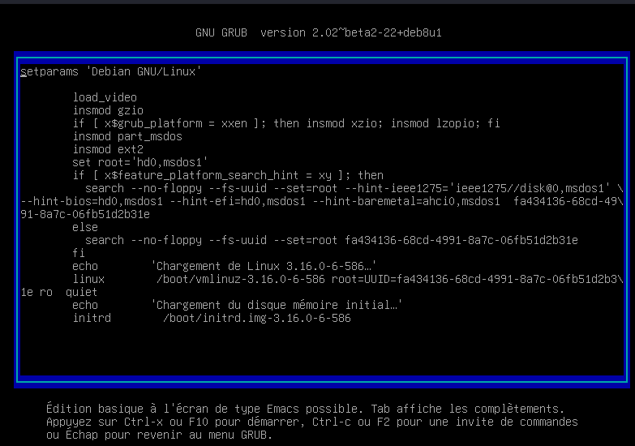
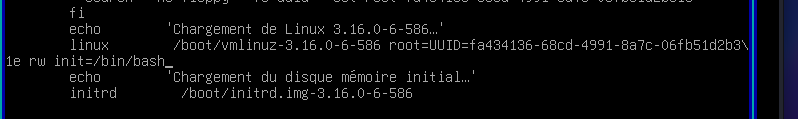
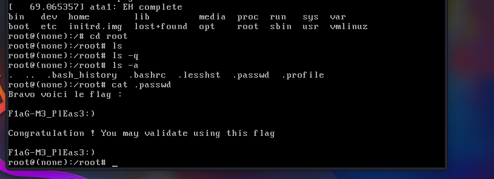

# Oh My Grub – Root-Me Challenge  
**Platform:** Root-Me | **Solved by:** Cherfa Firas  

> **Challenge:**  
> Your company has lost access to an old server. Unfortunately, it contains important files, and it’s up to you to recover them.  

# first step : Extract files and run the machine 
First, we are given a `.zip` file. Extract it using:  
unzip file.zip 
Inside, we find another archive: a `.tar` file. Extract it with:  
tar -xf file.tar
This gives us two files: root-disk001.vmdk and root.ovf. The `.vmdk` file is a virtual disk image, so we can boot it using QEMU:  
qemu-system-x86_64 root-disk001.vmdk -m 1280
qemu-system-x86_64 → Quick Emulator in full system mode for the x86_64 architecture  
-m 1280 → Allocates 1.28 GB of RAM to the VM  

  
  

# Second Step : change boot loading options 
Once QEMU starts, we see the GRUB boot menu. Select the first option and press e to edit the boot parameters:  

  
  
Find the line starting with linux. By default, it ends with:  
ro quiet
This means the root partition is mounted read-only and boot messages are hidden.  
We replace it with:  
rw init=/bin/bash
This allows read/write mode and starts a bash shell instead of the normal login screen:  

  
  
Press F10 or Ctrl + X to boot with these changes.  

# Third Step : get the flag
Now we are in a root shell. To view all files, run:  
ls -a

  
  
Congratulations! 🎉 We successfully bypassed the login, gained root access, and retrieved the flag.  
